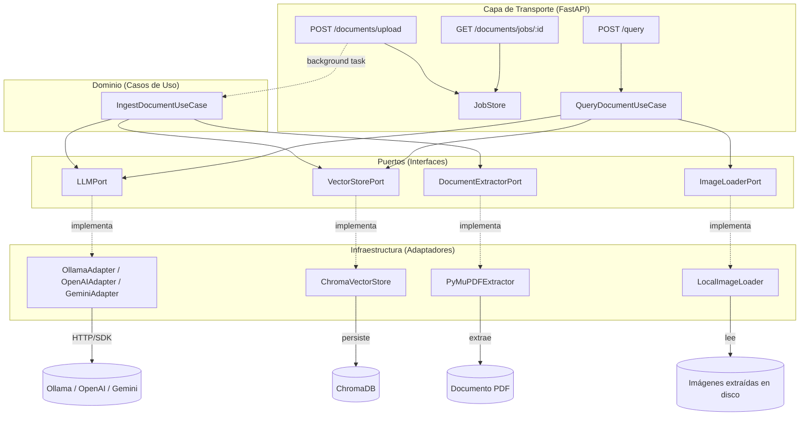

# Sistema RAG Multimodal

Sistema RAG (Retrieval-Augmented Generation) para procesar documentos técnicos PDF
(texto, tablas, imágenes y diagramas) y responder preguntas en lenguaje natural,
correlacionando el contexto textual con el contexto visual relevante.

## Arquitectura

Arquitectura hexagonal (puertos y adaptadores). El dominio (casos de uso) no
depende de ningún framework ni SDK externo; solo conoce interfaces (`ports/`).
Los adaptadores concretos (`infrastructure/`) son intercambiables sin tocar
la lógica de negocio.



### Flujo de ingesta (asíncrono)
1. Cliente sube PDF → API guarda el archivo y crea un `IngestionJob` (estado `pending`)
2. Responde inmediatamente con `job_id` (202 Accepted) — no bloquea
3. `BackgroundTask` ejecuta `IngestDocumentUseCase`:
   - Extrae texto (por bloques de layout), tablas (convertidas a Markdown) e
     imágenes (con bounding boxes) → `PyMuPDFExtractor`
   - Correlaciona texto-imagen por proximidad espacial en la página, con un
     fallback que garantiza que ninguna imagen quede sin un chunk que la referencie
   - Genera embeddings por chunk → `LLMPort`
   - Persiste en la base vectorial (espacio coseno) → `VectorStorePort`
   - Actualiza el estado del job en cada etapa (`processing` → `completed`/`failed`)
4. Cliente hace polling a `GET /documents/jobs/{job_id}` hasta ver `completed`

### Flujo de consulta
1. Pregunta del usuario → se genera su embedding
2. Búsqueda híbrida en ChromaDB: combina similitud semántica (70%, espacio coseno)
   + coincidencia de palabras clave (30%) — mitiga el punto débil de la búsqueda
   semántica pura con términos exactos (códigos, nombres propios)
3. **Detección de intención visual**: si la pregunta usa palabras como "imagen",
   "figura", "captura", "diagrama", etc., se activa el envío de imágenes al LLM.
   Preguntas puramente textuales (ej. "¿de qué trata el documento?") NO disparan
   esto, aunque el contexto recuperado incluya un chunk con imagen asociada —
   evita recortar innecesariamente el presupuesto de contexto de texto.
4. Si hay intención visual, se cargan (vía `ImageLoaderPort`) hasta 2 imágenes
   relacionadas a los chunks recuperados, codificadas en base64
5. Se arma el contexto (recortado si hay imágenes, ya que algunos modelos de
   visión tienen ventanas de contexto de texto más chicas) + metadata de fuente
6. Se aplica **prompt defensivo**: el LLM debe declarar explícitamente si no
   tiene contexto suficiente, en vez de inventar una respuesta
7. Respuesta + fuentes + imágenes relacionadas se devuelven al cliente; el
   frontend las renderiza junto a la respuesta

### Degradación ante modelos sin visión
Si `images_base64` se envía pero el modelo configurado no soporta contenido
multimodal, el proveedor devuelve un error 4xx (Ollama y Gemini) o `BadRequestError`
(OpenAI). Los tres adaptadores manejan esto igual: capturan el error y **reintentan
automáticamente una vez, solo con texto**, en vez de fallar la consulta completa.
El usuario recibe una respuesta basada en el contexto textual (ej. el pie de foto),
con el LLM declarando honestamente que no puede confirmar el contenido visual sin
verlo — nunca alucina una descripción falsa.

## Proveedores de LLM soportados

El sistema soporta **tres proveedores intercambiables**, todos implementando el
mismo `LLMPort`. El cambio se hace con una sola variable de entorno
(`LLM_PROVIDER`), sin tocar ninguna línea de la lógica de negocio:

| Proveedor | Variable | Generación | Embeddings | Visión | Notas |
|---|---|---|---|---|---|
| **Ollama** (local) | `LLM_PROVIDER=ollama` | `llama3.1`, u otros | `nomic-embed-text` | Solo con modelos que la soporten (ej. `moondream`) | Gratis, sin dependencia de red, pero lento en CPU (segundos-minutos por respuesta) |
| **OpenAI** | `LLM_PROVIDER=openai` | `gpt-4o-mini` | `text-embedding-3-small` | Sí (nativa) | Requiere créditos/tarjeta |
| **Gemini** | `LLM_PROVIDER=gemini` | `gemini-3.8-flash`* | `gemini-embedding-001`* | Sí (nativa, muy buena calidad) | **Capa gratuita** con límites generosos — usado para la demo de este proyecto por velocidad (respuestas en segundos) y calidad de descripción visual |

\* *Los modelos exactos disponibles en la API de Gemini cambian con el tiempo
(Google los va renovando); si alguno de estos deja de estar disponible, el
error 404 que devuelve la API indica el nombre del modelo vigente a usar en
su lugar. Verificar con `GET https://generativelanguage.googleapis.com/v1beta/models?key=TU_KEY`.*

## Decisiones técnicas

| Decisión | Por qué |
|---|---|
| **Arquitectura hexagonal** | Permite intercambiar Ollama ↔ OpenAI ↔ Gemini, o Chroma ↔ Qdrant, sin tocar la lógica de negocio. Es también lo que hace testeable el dominio con mocks puros. |
| **Chunking por bloques de layout (no por caracteres)** | `PyMuPDF` devuelve bloques de texto ya segmentados según el diseño visual del PDF (párrafos, títulos). Cortar por caracteres fijos rompe oraciones e ideas a la mitad; agrupar por bloques respeta la semántica del documento. |
| **Correlación texto-imagen por proximidad espacial, con fallback garantizado** | Se calcula la distancia vertical entre el bounding box del texto y el de cada imagen de la misma página. Si ninguna correlación cae dentro del umbral, la imagen igual se asocia al chunk de texto más cercano de esa página, para que ninguna imagen quede sin referencia recuperable. |
| **ChromaDB con espacio coseno explícito** | Por defecto Chroma usa distancia L2 al cuadrado, cuya escala es arbitraria y puede dar scores de "relevancia" negativos sin sentido al convertirlos a similitud. Forzar `hnsw:space: cosine` acota la distancia a [0, 2], permitiendo un score interpretable en [0, 1]. |
| **ChromaDB como servicio Docker aparte** | Corre como su propio contenedor (imagen oficial `chromadb/chroma`), no embebido en el proceso del backend. Refleja mejor un despliegue real, donde la base vectorial es infraestructura independiente que podría escalarse o compartirse entre múltiples backends. |
| **Extracción de tablas con `find_tables()` de PyMuPDF** | El enunciado pide extraer "texto estructurado, tablas e imágenes". Una tabla tratada como texto plano pierde su estructura de filas/columnas; se extrae por separado y se convierte a Markdown, preservando esa estructura para que el LLM la interprete correctamente. |
| **BackgroundTasks de FastAPI (no Celery)** | Celery + broker (Redis/RabbitMQ) añade complejidad operativa que no se justifica para el alcance de esta prueba. `BackgroundTasks` ya resuelve el requisito de no bloquear el hilo principal. El `JobStore` está aislado detrás de una clase propia, por lo que migrar a Celery + Redis después es un cambio localizado. |
| **Detección de intención visual por palabras clave** | Enviar imágenes al LLM en cada consulta —incluso cuando la pregunta es puramente textual— desperdicia presupuesto de contexto (crítico en modelos de visión livianos) y no aporta nada. Se activa el envío solo si la pregunta menciona explícitamente contenido visual (imagen, figura, captura, diagrama, etc.). |
| **Fallback automático si el modelo rechaza imágenes** | No todos los modelos configurables soportan visión (ej. `llama3.1` de Ollama). En vez de fallar la consulta con un error 400, los tres adaptadores de LLM detectan ese caso puntual y reintentan una sola vez solo con texto, devolviendo una respuesta honesta en vez de un error al usuario. |
| **Retry con distinción transitorio vs. no-transitorio** | Un error 5xx o de red amerita reintentar (backoff exponencial vía `tenacity`); un error 4xx (petición mal formada, modelo no encontrado, imagen rechazada) reintentar la misma petición no cambia el resultado — solo desperdicia tiempo. Los tres adaptadores distinguen ambos casos explícitamente. |
| **Streamlit para el frontend** | Prioriza velocidad de entrega sin sacrificar los requisitos (chat, markdown, imágenes, metadata de fuente) — están en el stack sugerido por la prueba. |
| **Gemini como proveedor de la demo** | Corriendo en CPU sin GPU, los modelos locales de Ollama (incluso los livianos con visión, como `moondream`) son lentos (1-3 minutos por respuesta) y de calidad descriptiva limitada. La capa gratuita de Gemini da respuestas en segundos con mucho mejor comprensión visual, sin costo. |

## Estructura del proyecto

```
app/
  core/            Configuración y container de inyección de dependencias
  domain/
    entities.py    Entidades puras (sin dependencias externas)
    ports/         Interfaces (LLMPort, VectorStorePort, DocumentExtractorPort, ImageLoaderPort)
    use_cases/     Lógica de negocio (Ingest, Query)
  infrastructure/
    llm/           Adaptadores Ollama / OpenAI / Gemini
    vector_store/  Adaptador ChromaDB
    extraction/    Adaptador PyMuPDF (texto, tablas, imágenes)
    storage/       LocalImageLoader (carga imágenes para el LLM de visión)
    job_store.py   Tracking de estado de ingesta
  api/
    routes/        Endpoints FastAPI
    schemas.py     DTOs de request/response
tests/             Tests unitarios con mocks (sin dependencias externas reales)
frontend/          Cliente Streamlit
```

## Cómo ejecutar

### Con Docker (recomendado)

```bash
cp .env.example .env
```

Editá `.env` y elegí tu proveedor:

**Opción A — Gemini (recomendado, gratis y rápido):**
```dotenv
LLM_PROVIDER=gemini
EMBEDDING_PROVIDER=gemini
GEMINI_API_KEY=tu_key_de_https://aistudio.google.com/apikey
GEMINI_MODEL=gemini-3.8-flash
GEMINI_EMBEDDING_MODEL=models/gemini-embedding-001
```

**Opción B — Ollama (local, sin API key, pero lento en CPU):**
```dotenv
LLM_PROVIDER=ollama
OLLAMA_MODEL=llama3.1
```

**Opción C — OpenAI (requiere créditos):**
```dotenv
LLM_PROVIDER=openai
OPENAI_API_KEY=tu_key
```

Luego:
```bash
docker-compose up --build
```

- Backend: http://localhost:8000/docs (Swagger UI)
- Frontend: http://localhost:8501

Si usás Ollama, después de levantar el contenedor descargá los modelos necesarios:

```bash
docker exec -it <nombre_contenedor_ollama> ollama pull llama3.1
docker exec -it <nombre_contenedor_ollama> ollama pull nomic-embed-text
```

### Local (sin Docker)

```bash
python -m venv venv
source venv/bin/activate  # Windows: venv\Scripts\activate
pip install -r requirements.txt
cp .env.example .env

uvicorn app.main:app --reload
# en otra terminal:
streamlit run frontend/streamlit_app.py
```

## Ejecutar tests

```bash
docker exec -it <nombre_contenedor_backend> pytest -v
```

14 tests unitarios que aíslan completamente LLM, base vectorial, extractor de PDF
y cargador de imágenes mediante mocks (`tests/conftest.py`) — corren sin red, sin
GPU y sin archivos PDF reales. Cubren: orquestación de ingesta, manejo de errores,
consulta con y sin contexto suficiente, detección de intención visual, límite de
imágenes por consulta, e imágenes no encontradas en disco.

## Posibles mejoras (fuera de alcance por tiempo)

- Migrar `JobStore` en memoria a Redis para persistencia entre reinicios y escalado horizontal
- Circuit Breaker explícito (además del retry) para cortar llamadas al LLM tras fallos consecutivos
- Re-ranker dedicado (ej. Cohere Rerank o cross-encoder local) en vez de pesos fijos en la búsqueda híbrida
- Chunking semántico basado en embeddings de oraciones en vez de bloques de layout puro
- Detección de intención visual con embeddings en vez de palabras clave (más robusto ante frases sin esas palabras exactas)
